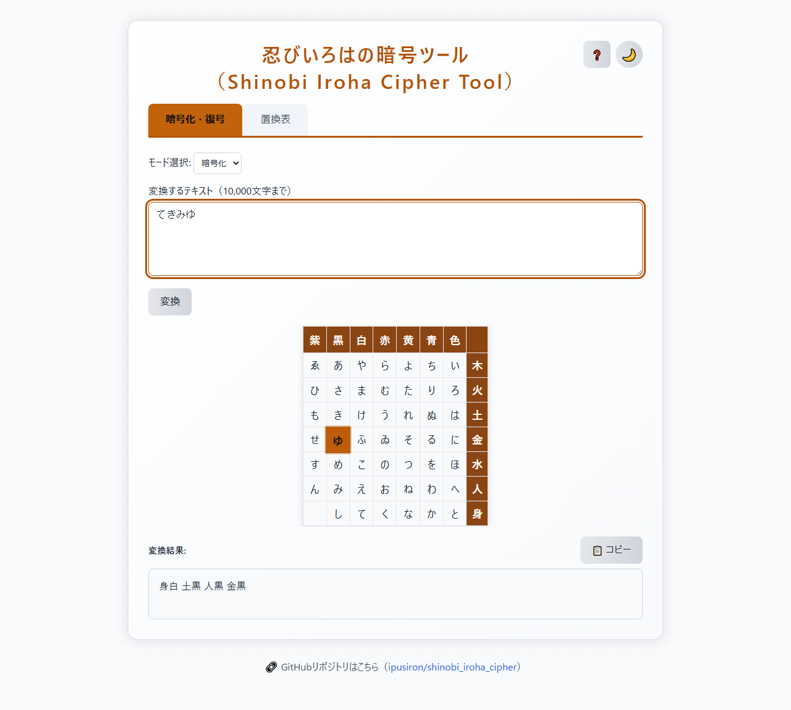
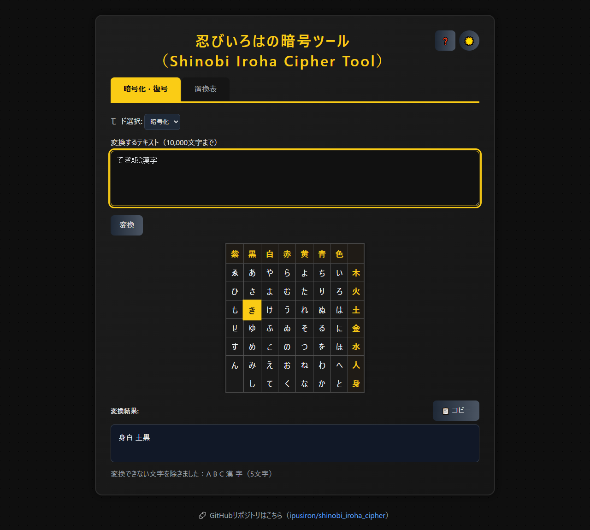
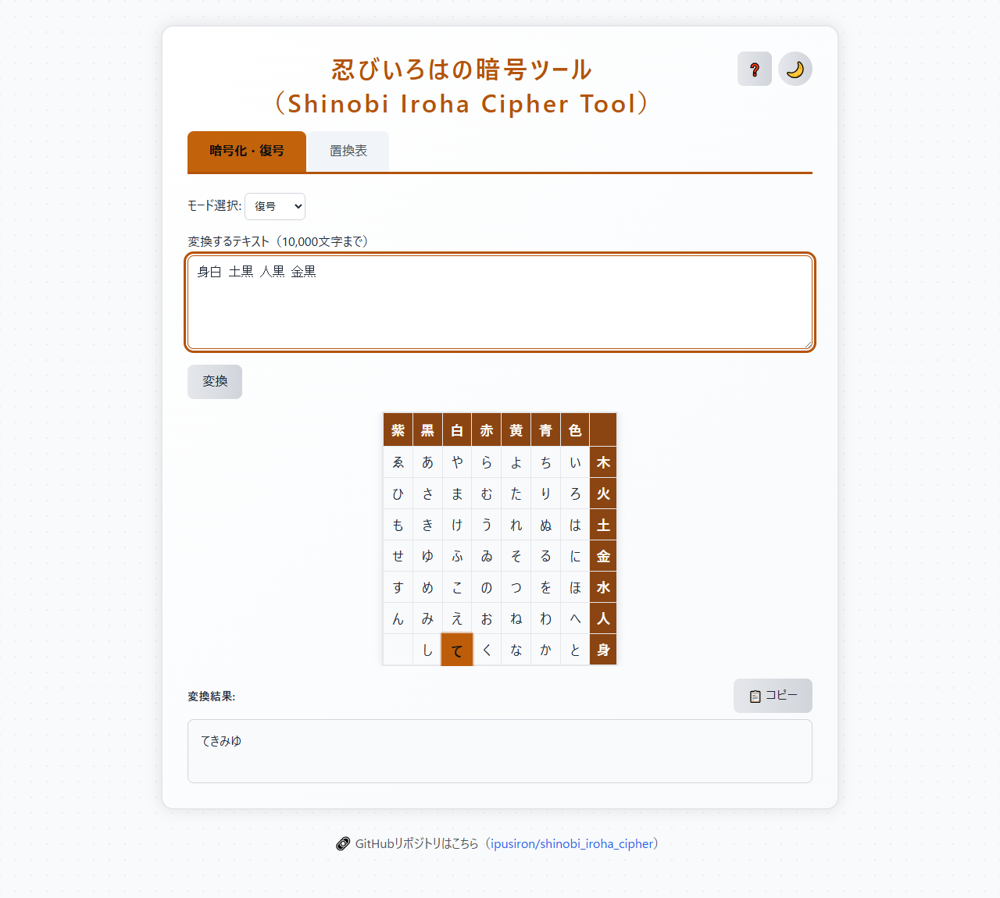
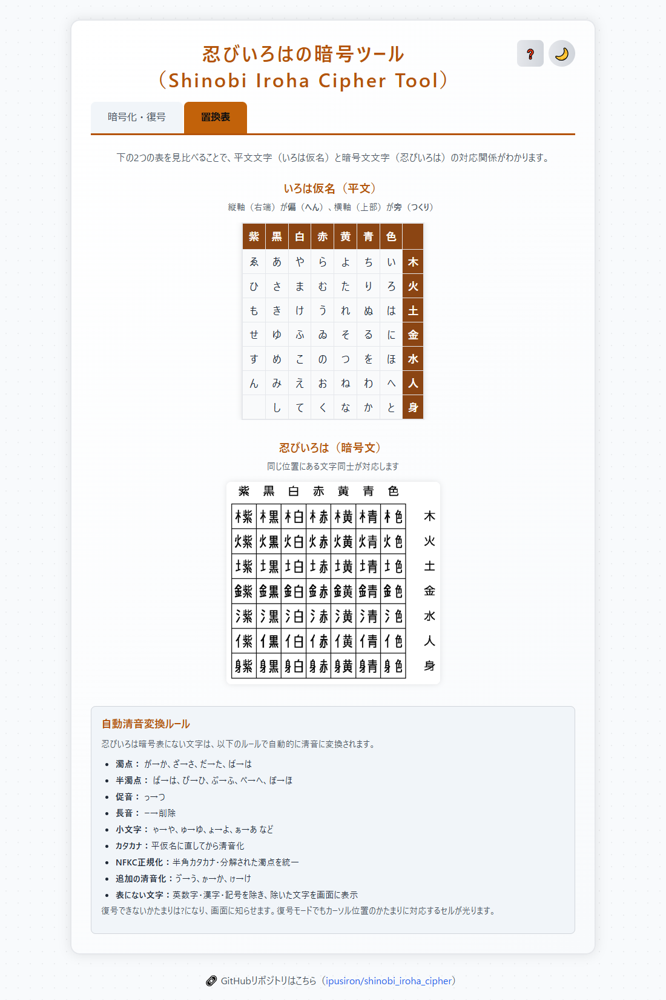
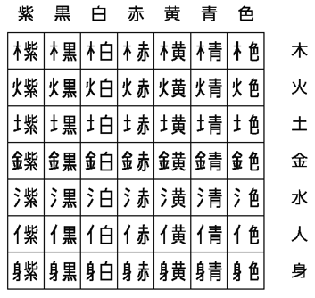

# Shinobi Iroha Cipher Tool

English · [日本語](README.md)


[](https://ipusiron.github.io/shinobi_iroha_cipher/)

**Day014 - 100 Security Tools with Generative AI**

A web tool that reproduces the shinobi iroha cipher, the substitution cipher recorded in the
*Bansenshūkai*, a manual of ninja craft compiled in Japan in 1676.

---

## 🌐 Demo

👉 [https://ipusiron.github.io/shinobi_iroha_cipher/](https://ipusiron.github.io/shinobi_iroha_cipher/)

---

## 📚 What the cipher is

A Japanese kanji is normally built from two parts: a part on the left, called the **hen**, and a
part on the right, called the **tsukuri**. Readers of Japanese take that structure for granted,
which is exactly what the cipher exploits.

The *Bansenshūkai* lays the 48 kana of the **iroha** order out on a seven-by-seven grid. Every row
is given a hen and every column a tsukuri, and each kana is then written as the character those two
parts would form. `て` sits in the `身` row and the `白` column, so it is written `身白`.

The point is not that the pairs are hard to guess. It is that the output does not look like a
cipher at all. A page of these characters reads as unfamiliar writing rather than as a message that
someone has deliberately hidden, and a courier carrying it is carrying a document, not a secret.

The characters themselves are known today as *shinobi iroha*. The ninja manuals give them no name
and no systematic treatment, so the label is a convenience coined by modern researchers.

### The iroha order

Before the Meiji era, Japanese was not learned in the *aiueo* order used today but in the order of
the **iroha** poem — a poem from the late Heian period that uses each kana exactly once:

```
いろはにほへと　ちりぬるを　わかよたれそ　つねならむ　うゐのおくやま　けふこえて　あさきゆめみし　ゑひもせす
```

That gives 47 kana. Adding `ん` makes 48, which fills 48 of the 49 squares in the grid. One square,
the one where the hen `身` meets the tsukuri `紫`, is left empty.

---

## 📸 Screenshots


> *Encrypting てきみゆ. The cell for ゆ, where the cursor sits, is highlighted.*


> *Letters, digits and kanji have no square in the grid, so they are left out and reported.*


> *Decrypting 身白 土黒 人黒 金黒. The first group, 身白, maps to て.*


> *The kana grid, the grid of shinobi iroha characters, and the clearing rules.*

---

## ✨ Features

### The cipher

- **Encrypt** — kana become pairs of parts (`てき` → `身白 土黒`)
- **Decrypt** — pairs become kana again (`身白 土黒` → `てき`)
- **Automatic clearing** — voicing marks and the small tsu are reduced to plain kana first
  - `だいじょうぶ` → `たいしようふ` → `火黄 木色 身黒 木黄 土赤 金白`

### While you work

- **⚡ Live conversion** — the result updates as you type
- **🎯 Highlighting** — the cell matching the character under the cursor lights up, in both modes
- **📋 Copy** — the result goes to the clipboard in one press
- **❓ Help** — the history of the cipher and how to use the tool

### The page

- **🗂️ Two tabs** — one for converting, one for the substitution table
- **🌙/☀️ Theme** — light and dark, remembered between visits
- **🌐 Japanese and English** — switch the wording of the page; your choice is remembered, and
  `?lang=en` or `?lang=ja` sets it from the URL
- **📱 Responsive** — the layout follows the width of the screen

---

## 📖 How to use it

### The tabs

- **Encrypt and decrypt** — the main tool, with the grid and live highlighting
- **Substitution table** — the kana grid and the cipher grid side by side, plus the clearing rules

### To encrypt

1. Open the **Encrypt and decrypt** tab
2. Set the mode to **Encrypt**
3. Type kana into the text box
4. The result appears as you type
5. Press 📋 to copy it

### To decrypt

1. Open the **Encrypt and decrypt** tab
2. Set the mode to **Decrypt**
3. Separate the groups with a space, a full-width space, a tab or a line break (say `身白 土黒`)
4. The kana come back, cleared of voicing marks. A group the grid does not know becomes `?`, and
   the tool says which groups those were

### Worked examples

| Input | After clearing | Ciphertext |
|---|---|---|
| てき | てき | 身白 土黒 |
| てきみゆ | てきみゆ | 身白 土黒 人黒 金黒 |
| だいじょうぶ | たいしようふ | 火黄 木色 身黒 木黄 土赤 金白 |
| しのび | しのひ | 身黒 水赤 火紫 |
| にんじゃ | にんしや | 金色 人紫 身黒 木白 |
| いろは | いろは | 木色 火色 土色 |
| コーヒー | こひ | 水白 火紫 |
| テキミユ | てきみゆ | 身白 土黒 人黒 金黒 |
| ﾃｷ | てき | 身白 土黒 |
| きょうと | きようと | 土黒 木黄 土赤 身色 |
| てきABC漢字 | てきABC漢字 | 身白 土黒 |
| ヴぁいおりん | うあいおりん | 土赤 木黒 木色 人赤 火青 人紫 |

---

## 🔬 How it works

### Clearing the kana first

Only the 48 plain kana have a square in the grid, so anything else is reduced to one of them first.

| Kind | What happens |
|------|--------|
| **Voiced (dakuten)** | が→か、ざ→さ、だ→た、ば→は |
| **Half-voiced (handakuten)** | ぱ→は、ぴ→ひ、ぷ→ふ、ぺ→へ、ぽ→ほ |
| **Small tsu (sokuon)** | っ→つ |
| **Long vowel mark** | ー is dropped |
| **Small kana** | ゃ→や、ゅ→ゆ、ょ→よ、ぁ→あ and so on |
| Katakana | turned into hiragana, then cleared |
| Half-width katakana, separated voicing marks | folded together by NFKC normalisation |
| Further clearing | ゔ→う、ゕ→か、ゖ→け |

Letters, digits, kanji and punctuation have no square, so they are left out of the ciphertext and
reported on screen along with how many there were. Spaces are dropped too. The input is capped at
10,000 characters; past that the tool says so and converts the first 10,000.

This clearing is lossy, and deliberately so — it is what the historical cipher does. It also means
decryption cannot give you back the voicing marks you started with.

### The grid

- Plaintext characters: the iroha kana
- Ciphertext characters: shinobi iroha, kanji-like characters of the cipher's own

>
>
> *The grid of shinobi iroha characters*

#### The same grid, filled with kana

| 紫 | 黒 | 白 | 赤 | 黄 | 青 | 色 |  |
|----|----|----|----|----|----|----|-----|
| ゑ | あ | や | ら | よ | ち | い | 木 |
| ひ | さ | ま | む | た | り | ろ | 火 |
| も | き | け | う | れ | ぬ | は | 土 |
| せ | ゆ | ふ | ゐ | そ | る | に | 金 |
| す | め | こ | の | つ | を | ほ | 水 |
| ん | み | え | お | ね | わ | へ | 人 |
| - | し | て | く | な | か | と | 身 |

Put the two grids together and you have the whole key. That correspondence *is* the cipher.

#### Reading the headings

The column headings are the tsukuri, the right-hand part:

| 紫 | 黒 | 白 | 赤 | 黄 | 青 | 色 |
|---|---|---|---|---|---|---|
| purple | black | white | red | yellow | blue | colour |

The right-hand column gives the hen, the left-hand part:

| 木 | 火 | 土 | 金 | 水 | 人 | 身 |
|---|---|---|---|---|---|---|
| wood | fire | earth | metal | water | person | body |

Five of the seven hen — wood, fire, earth, metal and water — are the five phases of **wu xing**,
the Chinese theory of the five elements. `人` (person) and `身` (body) round the set out to seven.

#### Why the headings stay in kanji

The tool keeps these kanji as they are when the page is in English, and the legend above is how it
explains them instead.

They are not labels for the grid. They are the ciphertext: `て` comes out as `身白`, and the grid is
how you look that up. Replace `白` with *White* and the grid can no longer account for its own
output.

The layout says the same thing. Measured in the browser, a heading cell holding `紫` is 38px wide
and one holding `Purple` is 72px; the whole grid goes from 302px to 516px. At a 390px viewport the
grid currently fits its container and would stop fitting.

### The hen `水`

When the hen is `水`, the historical character uses the radical form
**<ruby>三水<rp>(</rp><rt>sanzui</rt><rp>)</rp></ruby>** (氵), the three-drops-of-water form that
appears on the left of characters like 海 and 池. For practical reasons the tool prints `水`
instead.

**For example**

- encrypting `ほ`: historically `三水色`, here `水色`
- the real manuals write it with 氵

---

## 📐 The page

The **Encrypt and decrypt** tab has the input, the Convert button, the grid with highlighting, and
the result with its notices. The **Substitution table** tab has both grids and the clearing rules.
Left and right arrows, Home and End move between the tabs, and Escape closes the help dialog. The
`EN` button in the header switches between Japanese and English; your input, your result and any
notice on screen all survive the switch.

### Under the hood

- CSS custom properties hold the light and dark palettes
- localStorage holds the theme and the language, nothing else
- CSS Grid and Flexbox for the responsive layout
- the conversion itself is a DOM-free script, shared with the tests through CommonJS

---

## 🎯 What it is for

### ✅ Good uses

- **Teaching** — a worked example of a classical cipher
- **History** — Japanese cryptography and the craft of the shinobi
- **Games and puzzles** — writing notes your friends have to work at
- **Practice** — something small to try cryptanalysis on

### ❌ Bad uses

- **Protecting anything confidential** — business documents, personal data
- **Private communication** — mail, messages
- **Protecting data** — files, databases
- **Authentication or signatures**

---

## 🔒 Security

### How strong is it

The shinobi iroha cipher is a **classical cipher** and is **very weak** by any modern measure. It
offers no practical security, for these reasons.

#### What kind of cipher it is

- **Monoalphabetic substitution** — each kana always maps to the same pair, deterministically
- **No key** — there is no secret to hold back. Once the grid and the method are known, nothing
  remains hidden
- **A small alphabet** — 48 characters

#### Where it breaks

1. **Frequency analysis**
   - Japanese has a well-known distribution (`い`, `る`, `の` and so on are common)
   - even a short ciphertext gives statistical footholds
   - a few hundred characters break it reliably

2. **Pattern analysis**
   - the same kana always produces the same group
   - stock phrases and polite endings show through
   - sentence structure is visible

3. **Known plaintext**
   - a handful of matched pairs unravels the rest
   - greetings and set phrases are the obvious way in

4. **Dictionary attack**
   - matching against common words and idioms
   - names of people and places are easy guesses

### If you need real security

- **Symmetric**: AES-256, ChaCha20-Poly1305
- **Asymmetric**: RSA-2048 or better, ECDSA P-256 or better
- **Hashing**: SHA-256, SHA-3
- **In practice**: TLS 1.3, Signal Protocol, GPG

### 📊 Seeing the weakness

Once the plaintext is cleared, the same kana produces the same group every time.

- Plaintext: `しのびのものはしのびをしる` ("the shinobi knows the shinobi")
- Cleared: `しのひのものはしのひをしる`
- Ciphertext: `身黒 水赤 火紫 水赤 土紫 水赤 土色 身黒 水赤 火紫 水青 身黒 金青`
- Groups: 13
- Distinct: 7

| Group | Count | Answer |
|---|---|---|
| 水赤 | 4 | の |
| 身黒 | 3 | し |
| 火紫 | 2 | ひ |

Thirteen groups is not much, and already the most frequent ones point at `の` and `し`. Frequency
alone will not finish the job, but it gives you somewhere to start.

### What the tool does about its own safety

The fonts are system fonts, so there is no request to Google Fonts. Loading the page and converting
text make no request to anything outside your machine, and what you type never leaves it. A meta
CSP limits scripts and styles to the same origin and forbids inline execution and outbound
connections. The referrer policy is `no-referrer`, and the page is drawn with `textContent`.
localStorage holds the theme and the language, nothing else; if either value is missing or
unrecognised, or storage is unavailable, the page opens in light mode and picks the language from
`?lang=` and your browser's settings. Following the link in the footer does, of course, reach
GitHub.

---

## ❓ FAQ

### Can I get the voicing marks and the spacing back?

No. Decryption gives you the cleared kana with the out-of-grid characters and the spaces already
gone. `身白土黒`, written without a separator, is one unknown group and comes back as `?`.

### Could this keep a real secret?

There is no key, and the grid is published. It is for learning and for puzzles.

---

## 🧪 Tests

Run `npm test` with Node 22 or newer. There are no dependencies and no network access. GitHub
Actions runs the suite on every push and pull request.

Beyond encryption, decryption, cursor position and the 48-character round trip, the suite checks
the tables and worked examples in this README, the frequency figures, the image references, the
HTML and the colour contrast. For the two languages it checks that the dictionaries have the same
keys, that the placeholders line up, that nothing was left untranslated, and that the grid headings
were *not* translated.

---

## 🔗 References

- [Searching for the *Bansenshūkai* (National Diet Library Search)](https://ndlsearch.ndl.go.jp/search?keyword=万川集海)
- [Source code](https://github.com/ipusiron/shinobi_iroha_cipher)

---

## 📁 Layout

```text
shinobi_iroha_cipher/
├── index.html              # the two tabs and the help dialog
├── style.css               # palettes, responsive layout, focus styles
├── script.js               # the DOM, and the cap on input length
├── i18n.js                 # the two dictionaries and the switch
├── shinobi-logic.js        # clearing, encryption, decryption, cursor position
├── favicon.svg             # a local icon
├── assets/                 # the grid image and the screenshots
├── test/                   # the test suite, on Node's built-in runner
├── .github/workflows/test.yml # tests on push and pull request
├── package.json            # defines npm test; no dependencies
├── .nojekyll               # skip Jekyll on GitHub Pages
├── .gitignore              # what Git ignores
├── CLAUDE.md               # house rules for development
├── README.md               # the Japanese README
├── README.en.md            # this file
└── LICENSE                 # MIT
```

---

## 💻 Requirements

Any modern browser (Chrome, Firefox, Safari, Edge). Internet Explorer is not supported. Nothing
uses ES modules, so you can open `index.html` straight from the filesystem with `file://`. To serve
it over HTTP, run this in the repository root and open `http://localhost:8000/`:

```sh
python -m http.server 8000
```

The tests need Node 22 or newer.

---

## 📄 License

MIT License — see [LICENSE](LICENSE).

---

## 🛠️ About this tool

This tool was built as part of **100 Security Tools with Generative AI**, a project that produces
and publishes one security-related tool a day for 100 days, with AI as a collaborator.

🔗 [https://akademeia.info/?page_id=42163](https://akademeia.info/?page_id=42163)
