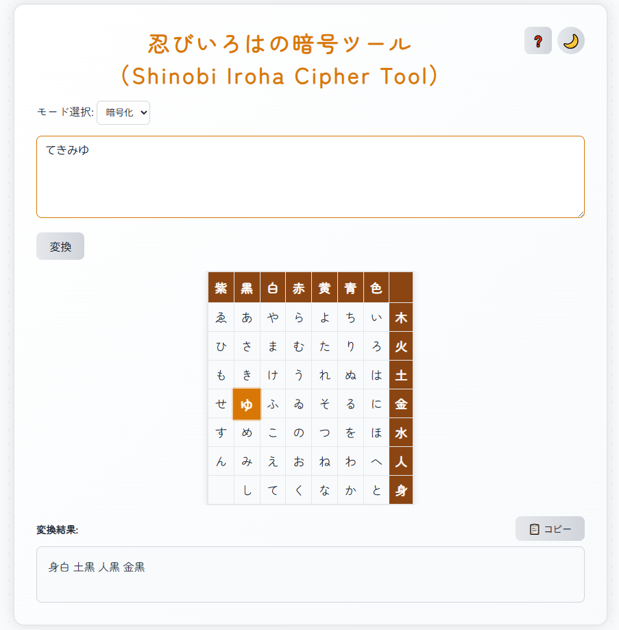
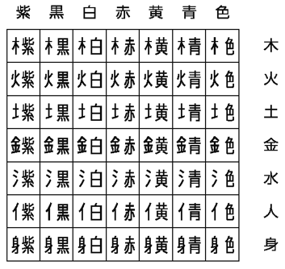

<!--
---
id: day014
slug: shinobi_iroha_cipher

title: "Shinobi Iroha Cipher"

subtitle_ja: "『万川集海』に登場する忍者の暗号「忍びいろは暗号」を再現"
subtitle_en: "Recreating the Ninja Cipher from 'Bansenshukai'"

description_ja: "江戸時代の忍術書『万川集海』に記載された「忍びいろは暗号」を再現したWebツール。ひらがなを漢字の偏と旁の組み合わせで暗号化・復号できます。"
description_en: "A web tool recreating the 'Shinobi Iroha Cipher' from the Edo period ninja manual 'Bansenshukai'. Encrypts and decrypts hiragana using combinations of kanji radicals."

category_ja:
  - 古典暗号
  - 換字式暗号
category_en:
  - Classical Cryptography
  - Substitution Cipher

difficulty: 1

tags:
  - cipher
  - ninja
  - japanese-history
  - education

repo_url: "https://github.com/ipusiron/shinobi_iroha_cipher"
demo_url: "https://ipusiron.github.io/shinobi_iroha_cipher/"

hub: true
---
-->

# 忍びいろはの暗号ツール（Shinobi Iroha Cipher Tool）

**Day014 - 生成AIで作るセキュリティツール100**

忍術書『万川集海』に登場する「忍びいろはの暗号」を再現したWebツールです。

---

## 🌐 デモページ

👉 [https://ipusiron.github.io/shinobi_iroha_cipher/](https://ipusiron.github.io/shinobi_iroha_cipher/) 

---

## 📸 スクリーンショット

以下は実際の画面例です。

>
>
> *「てきみゆ」（敵見ゆ）を暗号化したところ*

---

## 🎯 主要機能

### 基本機能
- **暗号化**：ひらがなを「偏＋旁」の暗号文に変換（例：「てき」→「身白 土黒」）
- **復号**：暗号文から元のひらがなを復号（例：「身白 土黒」→「てき」）
- **自動清音変換**：濁点・半濁点・促音を自動的に清音に変換してから暗号化
  - 例：「だいじょうぶ」→「たいしようふ」→「火黄 木色 身黒 木黄 土赤 金白」

### インタラクティブ機能
- **⚡ リアルタイム変換**：テキスト入力と同時に即座に変換結果を表示
- **🎯 ハイライト表示**：カーソル位置の文字がテーブル上で自動ハイライト
- **📋 ワンクリックコピー**：変換結果をクリップボードに瞬時にコピー
- **❓ 詳細ヘルプ**：忍びいろは暗号の歴史的背景と使い方を解説

### UI/UX機能
- **🌙/☀️ テーマ切り替え**：ダークモード・ライトモードの切り替え（設定自動保存）
- **📱 レスポンシブデザイン**：スマートフォン・タブレットに完全対応
- **✨ アニメーション効果**：スムーズなトランジションとホバーエフェクト

---

## 🔤 文字変換対応表

### 自動清音変換
忍びいろは暗号表にない文字は、以下のルールで自動的に清音に変換されます：

| 種類 | 変換例 |
|------|--------|
| **濁点** | が→か、ざ→さ、だ→た、ば→は |
| **半濁点** | ぱ→は、ぴ→ひ、ぷ→ふ、ぺ→へ、ぽ→ほ |
| **促音** | っ→つ |
| **長音** | ー→削除 |
| **小文字** | ゃ→や、ゅ→ゆ、ょ→よ、ぁ→あ など |

### 忍びいろは置換表

- 平文文字：いろは仮名
- 暗号文文字：忍びいろは（独自の漢字）

忍びいろはは、偏と旁で構成された、漢字風の文字です。
「色～紫」が旁、「木～身」が偏を構成するので、列ヘッダーと行ヘッダーに配置した表で表わすことができます。

>
>
> *忍びいろはの構成表*

#### いろは仮名との対応（復号用の置換表）

いろは仮名も、同一の表を埋める形で配置します。

| 紫 | 黒 | 白 | 赤 | 黄 | 青 | 色 | 偏 |
|----|----|----|----|----|----|----|-----|
| ゑ | あ | や | ら | よ | ち | い | 木 |
| ひ | さ | ま | む | た | り | ろ | 火 |
| も | き | け | う | れ | ぬ | は | 土 |
| せ | ゆ | ふ | ゐ | そ | る | に | 金 |
| す | め | こ | の | つ | を | ほ | 水 |
| ん | み | え | お | ね | わ | へ | 人 |
| - | し | て | く | な | か | と | 身 |

2つの表により、「いろは仮名⇔忍びいろは」の対応関係ができあがります。
この対応こそが、当該暗号の置換表（暗号表）そのものです。

---

## ⚠️ 重要な注意事項

### 偏「水」の表記について

忍びいろは暗号において、偏が「水」の場合、本来は**三水（さんずい）**として表現されますが、プログラムの都合上、このツールでは**「水」**として出力されます。

**例：**
- 「ほ」の暗号化：本来「三水色」→ このツール「水色」
- 実際の忍術では三水（氵）で書かれていたことをご理解ください

---

## 🚀 使い方

### 暗号化の手順
1. モード選択で「暗号化」を選択
2. テキスト入力欄にひらがなを入力
3. リアルタイムで変換結果が表示されます
4. 必要に応じて📋ボタンで結果をコピー

### 復号の手順
1. モード選択で「復号」を選択
2. 暗号文を半角スペース区切りで入力（例：「身白 土黒」）
3. 元のひらがなが表示されます

### ハイライト機能
- 暗号化モードでカーソル位置の文字がテーブル上で光ります
- 濁点などは清音変換後の文字がハイライトされます

---

## 🛠 技術仕様

### ファイル構成
```
shinobi_iroha_cipher/
├── index.html          # メインページ
├── style.css           # スタイルシート
├── script.js           # JavaScript ロジック
└── README.md           # このファイル
```

### 対応ブラウザー

- モダンブラウザー（Chrome, Firefox, Safari, Edge の最新版）
- Internet Explorerは非対応

### 技術的特徴
- **CSS変数**によるテーマ管理
- **LocalStorage**による設定保存
- **CSS Grid/Flexbox**によるレスポンシブレイアウト
- **ES6+** のモダンJavaScript

---

## 📚 「忍びいろは暗号」について

忍びいろは暗号は、江戸時代の忍術書『万川集海』に記載されている古典暗号です。
ひらがなを漢字の「偏（へん）」と「旁（つくり）」の組み合わせで表現することで、文字を秘匿する方法として使われていました。

詳細は新刊で解説する予定です。

### 『万川集海』に登場する「忍びいろは暗号」の詳細解説

『万川集海』の巻ノ五では、「当家流の陰書　ただし大秘事口伝」として、いろは仮名と漢字（一部は実在しない独自の漢字）を対応させた暗号が紹介されています。

ここでいう「いろは」とは、47文字で日本語の音をすべて表した「いろは仮名」のことです。
最後に「京」や「ん」を加えて48文字とすることもあります。現代は「あいうえお」「かきくけこ」…という50音字順で仮名を覚えますが、明治時代以前は「いろはにほへと…」のいろは順が一般的でした。

いろは歌とは、平安時代末期に流行した、七五を四回繰り返す今様【いまよう】という歌謡形式を守りつつ、仮名一文字を一度ずつ使うという制約のもとで作られたものです。
代表的ないろは歌は、以下のとおりです。

```
いろはにほへと　ちりぬるを　わかよたれそ　つねならむ　うゐのおくやま　けふこえて　あさきゆめみし　ゑひもせす
```

漢字かな交じり文にすると、次のようになります。

```
色は匂へど　散りぬるを　我が世たれぞ　常ならむ　有為の奥山　今日越えて　浅き夢見じ　酔ひもせず
```

忍びいろはでは、偏【へん】（漢字の左側）と旁【つくり】（漢字の右側）を組み合わせた独自の漢字を暗号として利用します。
この漢字は俗に「忍びいろは」と呼ばれていますが、忍術書にはその名称や体系的な記述は見られないため、現代の研究者が便宜的に名づけた名称が一般化したものと考えられています。

忍びいろはは計49文字（＝7×7）あり、それぞれに「いろは」の48文字を対応させています。

7行7列の碁盤目を描き、右上からいろは仮名を順に並べていきます。そして、各列には偏の候補を、各行には旁の候補を割り当てます。

偏の候補には、五行説【ごぎょうせつ】に基づく「木」「火」「土」「金」「水」に、「人」と「身」を加えた計7文字を採用しています。
対して、旁の候補には「色」「青」「黄」「赤」「白」「黒」「紫」の計7文字を採用しています。

例えば、いろは仮名「い」は、偏が「木」、旁が「色」の交差点に位置するため、対応する忍びいろは文字は「栬」になります。

---

## 🔒 セキュリティについて

### ⚠️ 暗号強度の評価

忍びいろは暗号は**古典暗号**であり、現代の暗号学的基準では**極めて脆弱**です。以下の理由により、実用的なセキュリティは提供されません：

#### 暗号方式の特徴
- **単一換字式暗号**：各ひらがなが固定的に漢字ペアに対応。
   - 同一の平文文字が同一の暗号文文字に対応する。確定的。
- **鍵の概念なし**：暗号化に秘密鍵が存在しない。置換表と暗号化・復号のロジックが露呈すれば、暗号としての秘匿性は皆無。
- **アルファベット数**：48文字（いろは48文字）と限定的。

#### 主な脆弱性

1. **頻度分析攻撃**
   - 日本語の文字出現頻度（「い」「る」「の」等が高頻度）
   - 短い暗号文でも統計的解析で解読可能
   - 数百文字程度で確実に破られる

2. **パターン分析**
   - 同じ文字は常に同じ暗号文になる
   - 「です・ます調」等の定型パターンが露呈
   - 文章構造から推測可能

3. **既知平文攻撃**
   - 一部の平文と暗号文のペアが判明すれば全体が解読
   - 挨拶文や定型句から突破口を見つけられる

4. **辞書攻撃**
   - 一般的な単語や慣用句との照合
   - 人名・地名等の固有名詞からの推測

### 🎯 適切な使用目的

#### ✅ 推奨用途
- **教育目的**：古典暗号学の学習教材
- **文化的体験**：日本の暗号史、忍者の暗号を学ぶ
- **ゲーム・パズル**：友人との暗号ゲーム
- **研究・分析**：暗号解読技術の練習

#### ❌ 非推奨用途
- **機密情報の保護**：ビジネス文書・個人情報等
- **通信の秘匿**：メール・メッセージの暗号化
- **データ保護**：ファイルやデータベースの暗号化
- **認証・署名**：本人確認や改ざん検知

### 🛡️ 現代的な暗号化が必要な場合

実際のセキュリティが必要な場合は、以下の現代暗号技術を使用してください：

- **対称暗号**：AES-256, ChaCha20-Poly1305
- **非対称暗号**：RSA-2048以上, ECDSA P-256以上
- **ハッシュ関数**：SHA-256, SHA-3
- **実装**：TLS 1.3, Signal Protocol, GPG等

### 📊 脆弱性実証例

以下は頻度分析による解読の簡単な例です：

```
暗号文：「火黄 木色 身黒 木黄 土赤 金白」
↓ 頻度分析
「木黄」が2回出現 → 高頻度文字「い」の可能性
「火黄」「身黒」等から動詞活用パターンを推測
↓ 結果
「だいじょうぶ」（清音変換後：「たいしようふ」）
```

この例のように、わずか6文字の暗号文でも解読の手がかりが十分に存在します。

---

## 📄 ライセンス

MIT License - [LICENSE](LICENSE)ファイルを参照

---

## 🛠 このツールについて

本ツールは、「生成AIで作るセキュリティツール100」プロジェクトの一環として開発されました。 このプロジェクトでは、AIの支援を活用しながら、セキュリティに関連するさまざまなツールを100日間にわたり制作・公開していく取り組みを行っています。

プロジェクトの詳細や他のツールについては、以下のページをご覧ください。

🔗 [https://akademeia.info/?page_id=42163](https://akademeia.info/?page_id=42163)

